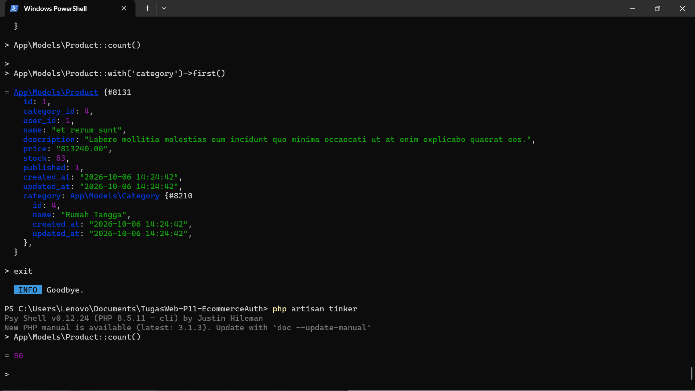
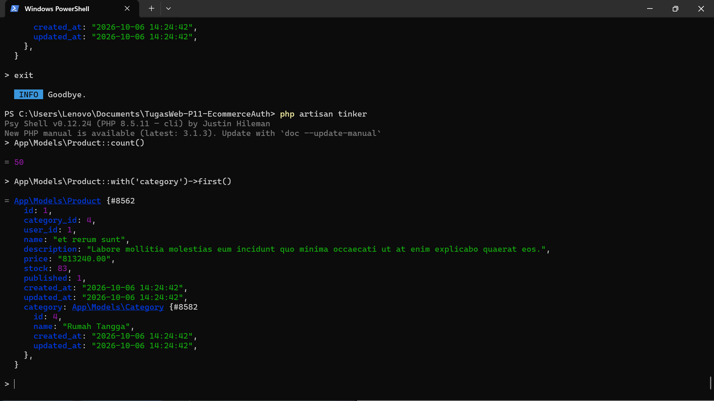
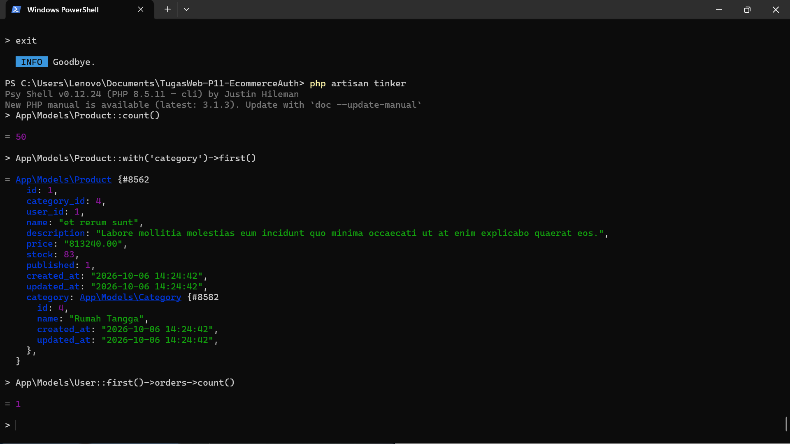
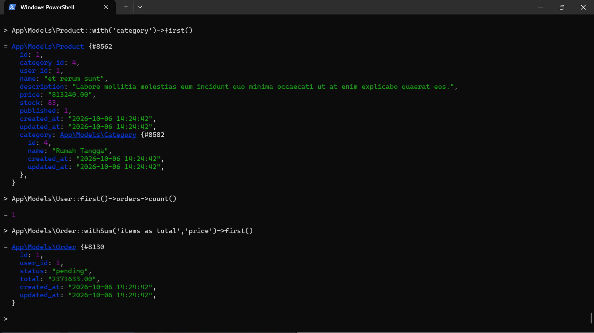
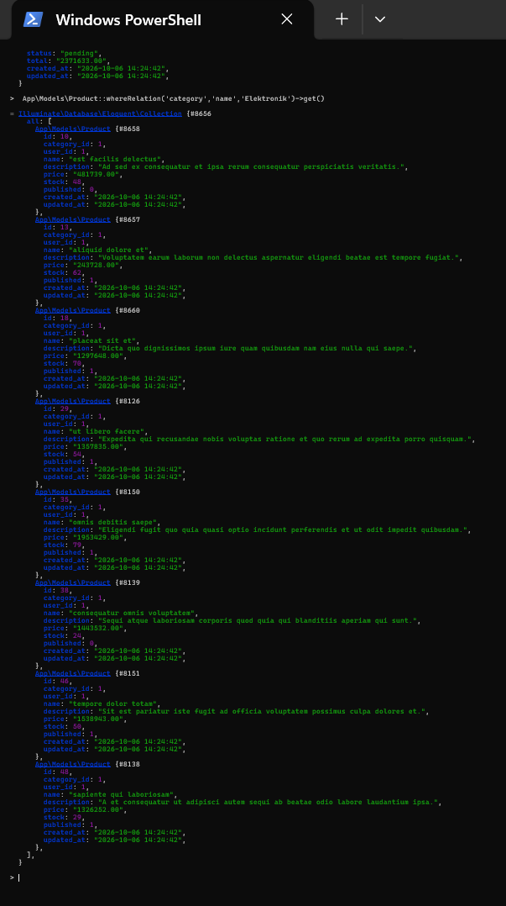

# TugasWeb-P11-EcommerceAuth

Tugas Rutin 11 Pemrograman Web menggunakan Laravel dengan materi E-Commerce Database dan Secure Authentication.

## Fitur

- Database e-commerce menggunakan MySQL
- 7 tabel e-commerce dengan foreign key
- Seeder dan Factory
- 50 data produk
- Eloquent Model dan Relationships
- Eloquent Scope
- Login, Register, dan Logout menggunakan Laravel Breeze
- Multi-role: admin, editor, dan user
- Custom Role Middleware
- PostPolicy untuk edit dan delete
- Route protection

## Dokumentasi 5 Query Tinker

### Menghitung Jumlah Produk

### Mengambil Produk Beserta Kategorinya

### Menghitung Jumlah Order User

### Menghitung Total Harga Order

### Mengambil Produk Berdasarkan Kategori

